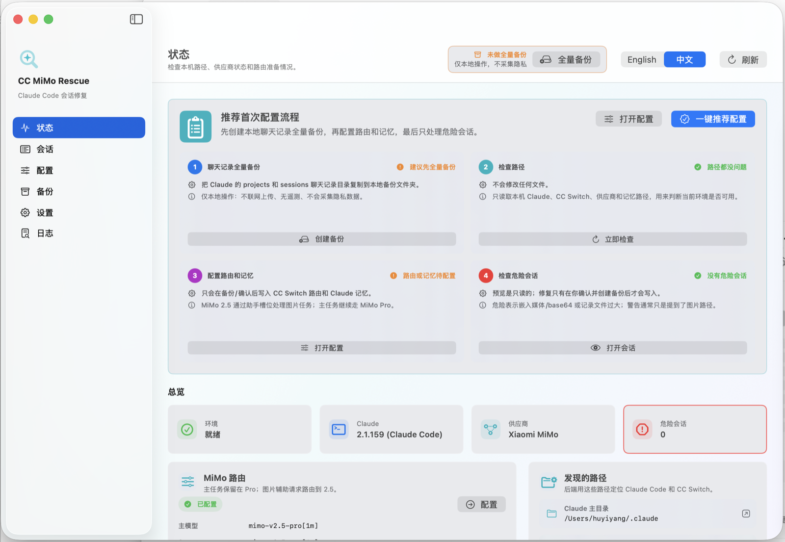

# CC MiMo Rescue

简体中文 | [English](#english)

一个本地运行的 macOS 小工具，用来辅助 Claude Code + CC Switch + 小米 MiMo 工作流，先备份聊天记录，再把图片/绘画任务引导到更合适的助手模型，避免主对话被图片、PDF 图片块或大段 base64 卡住。

<table align="center">
  <tr>
    <td align="center" width="180">
      <br>
      <strong>CC MiMo Rescue</strong>
    </td>
    <td align="center" width="280">
      <br>
      欢迎扫码加入群聊，讨论使用问题、交流想法，也会发布产品发布和更新通知。
    </td>
  </tr>
</table>

<p align="center">
  
</p>

## Highlights

- 本地-only：不上传聊天记录、备份、token 或遥测数据。
- 写入前预览：修复会话、修改 CC Switch 路由、写入 Claude memory 前都需要确认。
- 可回滚：修复和配置写入会创建本机备份，支持在 App 内恢复。
- 双语原生 App：SwiftUI macOS 界面，支持中文和 English 切换。
- 可更新：v0.1.1 起内置 Sparkle 更新通道，App 菜单提供 `Check for Updates...`。

## Why

Claude Code 会话里如果混入图片、PDF 图片块、大段 base64 或嵌入媒体内容，可能让主对话变慢、卡死，甚至难以继续打开。

CC MiMo Rescue 的思路是：

1. 先备份聊天记录；
2. 让图片/绘画任务走更轻的助手模型；
3. 把 Claude memory 写清楚，避免主对话直接读取图片/二进制；
4. 对已经出问题的危险会话，只在预览后做最小修复。

## Installation

推荐从 [GitHub Releases](https://github.com/hututuo/cc-mimo-rescue/releases/latest) 下载最新版 DMG：

1. 下载 `CC-MiMo-Rescue-0.1.1.dmg` 和 `SHA256SUMS-v0.1.1.txt`。
2. 校验 DMG：

   ```bash
   shasum -a 256 CC-MiMo-Rescue-0.1.1.dmg
   ```

3. 打开 DMG，把 `CC MiMo Rescue.app` 拖到 Applications。
4. 首次打开如果提示“未知开发者”：系统设置 -> 隐私与安全 -> 找到 `CC MiMo Rescue` -> 点“仍要打开” -> 确认“打开”。

当前构建是 ad-hoc signed，尚未使用 Apple Developer ID 签名，也未 notarize。请只从官方 Release 下载，并在打开前核对 SHA256。

备用安装方式：

```bash
curl -fsSL https://raw.githubusercontent.com/hututuo/cc-mimo-rescue/main/install.sh | bash
```

这条命令会下载 GitHub Release 里的 `.app.zip`，解压到：

```text
~/Applications/CC MiMo Rescue.app
```

默认安装到当前用户目录 `~/Applications`，所以不会要求输入管理员密码。如需安装到系统级 `/Applications`：

```bash
curl -fsSL https://raw.githubusercontent.com/hututuo/cc-mimo-rescue/main/install.sh | INSTALL_DIR=/Applications bash
```

## Requirements

- macOS 15 或更新版本；
- 本机可用 `/usr/bin/python3`，如果缺失可先运行 `xcode-select --install`；
- 本机已有 Claude Code 配置；
- 如需修改模型路由，需要本机已有 CC Switch 数据库。

打包后的 App 会携带 Python 后端源码，但仍使用系统 Python 运行。它不会安装 daemon、LaunchAgent、本地服务器、浏览器扩展或后台服务。

## Updates

v0.1.1 起，App 内置 Sparkle 更新通道：

- 菜单栏：`CC MiMo Rescue` -> `Check for Updates...`；
- 更新 feed：`https://github.com/hututuo/cc-mimo-rescue/releases/latest/download/appcast.xml`；
- 更新 ZIP 使用 Sparkle EdDSA 签名验证；
- 如果内置更新失败，可以从 GitHub Releases 手动下载安装。

## Privacy

本软件只在本机运行。

- 不联网传输聊天记录；
- 不上传备份；
- 不做遥测；
- 不需要账号；
- 不采集隐私数据；
- 备份、审计日志、修复后的文件都保存在你的电脑上。

详细说明见 [PRIVACY.md](PRIVACY.md)。

## Safety Model

软件打开时不会自动做全盘扫描，也不会自动创建全量备份。

所有写入操作都需要用户明确确认：

- 创建聊天记录全量备份；
- 修复某个会话记录；
- 修改 CC Switch 模型路由；
- 写入或复位 Claude memory 规则；
- 恢复单文件备份。

写入前会在本机备份目录中保存备份：

```text
~/.local/share/cc-mimo-rescue/backups
```

全量聊天记录备份会复制：

```text
~/.claude/projects
~/.claude/sessions
```

## Features

- 原生 SwiftUI macOS App；
- 中文/英文双语界面；
- 本地路径自动发现；
- 本地全量聊天记录备份；
- 备份列表和单文件恢复；
- 会话危险程度筛选；
- 媒体/base64 清理预览；
- 确认后带备份修复；
- CC Switch 每个 Claude 模型槽位单独配置；
- Claude memory 规则预览、应用、复位；
- 本地审计日志。

## From Source

后端：

```bash
cd backend
PYTHONPATH=src python3 -m cc_mimo_rescue doctor --json
```

前端：

```bash
cd frontend
swift run CCMimoRescueUI
```

本地发布包：

```bash
cd frontend
SPARKLE_PRIVATE_KEY_FILE="$HOME/.config/cc-mimo-rescue/sparkle-ed25519-private.key" \
  scripts/package-release.sh
```

输出位置：

```text
frontend/dist/release-v0.1.1/
```

## License

MIT License. See [LICENSE](LICENSE).

---

## English

CC MiMo Rescue is a local macOS utility for Claude Code + CC Switch + Xiaomi MiMo workflows. It backs up Claude chat records first, routes image-heavy work to a helper model, and keeps image/PDF/base64 payloads away from the main conversation path.

<table align="center">
  <tr>
    <td align="center" width="180">
      <br>
      <strong>CC MiMo Rescue</strong>
    </td>
    <td align="center" width="280">
      <br>
      Scan to join the community for support, ideas, release news, and update notices.
    </td>
  </tr>
</table>

<p align="center">
  
</p>

## Highlights

- Local-only: no transcript upload, backup upload, token collection, or telemetry.
- Preview before writes: session repair, CC Switch routing, and Claude memory changes require confirmation.
- Rollback-friendly: write operations create local backups that can be restored in the app.
- Native bilingual app: SwiftUI macOS UI with Chinese and English switching.
- Updatable: v0.1.1 adds Sparkle updates via `Check for Updates...` in the app menu.

## Why

When Claude Code transcripts contain images, PDF image blocks, large base64 chunks, or embedded media, the main conversation can become slow, stuck, or hard to reopen.

CC MiMo Rescue helps by:

1. backing up chat records first;
2. routing image and drawing tasks to a lighter helper model;
3. writing clear Claude memory guardrails so the main conversation avoids raw image/binary content;
4. repairing risky sessions only after a local preview.

## Installation

Download the latest DMG from [GitHub Releases](https://github.com/hututuo/cc-mimo-rescue/releases/latest):

1. Download `CC-MiMo-Rescue-0.1.1.dmg` and `SHA256SUMS-v0.1.1.txt`.
2. Verify the DMG:

   ```bash
   shasum -a 256 CC-MiMo-Rescue-0.1.1.dmg
   ```

3. Open the DMG and drag `CC MiMo Rescue.app` into Applications.
4. If macOS shows an unidentified developer warning: System Settings -> Privacy & Security -> find `CC MiMo Rescue` -> click `Open Anyway` -> confirm `Open`.

This build is ad-hoc signed and is not Apple notarized. Download only from the official release page and verify the SHA256 checksum before opening.

Backup install:

```bash
curl -fsSL https://raw.githubusercontent.com/hututuo/cc-mimo-rescue/main/install.sh | bash
```

The script downloads the official `.app.zip` from GitHub Releases and installs it to:

```text
~/Applications/CC MiMo Rescue.app
```

To install into `/Applications` instead:

```bash
curl -fsSL https://raw.githubusercontent.com/hututuo/cc-mimo-rescue/main/install.sh | INSTALL_DIR=/Applications bash
```

## Requirements

- macOS 15 or newer;
- `/usr/bin/python3`; run `xcode-select --install` first if it is missing;
- an existing local Claude Code setup;
- an existing CC Switch database if you want the app to change model routing.

The packaged app bundles the Python backend source but still runs it with system Python. It does not install a daemon, LaunchAgent, local server, browser extension, or background service.

## Updates

Starting in v0.1.1, the app includes Sparkle updates:

- menu path: `CC MiMo Rescue` -> `Check for Updates...`;
- feed URL: `https://github.com/hututuo/cc-mimo-rescue/releases/latest/download/appcast.xml`;
- update ZIPs are verified with Sparkle EdDSA signatures;
- if in-app updates fail, reinstall manually from GitHub Releases.

## Privacy

The app runs locally.

- No chat transcript upload.
- No backup upload.
- No telemetry.
- No account required.
- No private data collection.
- Backups, audit logs, and repaired files stay on your computer.

See [PRIVACY.md](PRIVACY.md).

## Safety Model

The app does not scan everything or create a full backup automatically at launch.

Every write operation requires explicit confirmation:

- creating a full chat backup;
- repairing a session transcript;
- changing CC Switch model routing;
- applying or resetting Claude memory rules;
- restoring a backed-up file.

Backups are stored under:

```text
~/.local/share/cc-mimo-rescue/backups
```

Full chat backups copy:

```text
~/.claude/projects
~/.claude/sessions
```

## Features

- Native SwiftUI macOS app;
- Chinese/English UI;
- local path discovery;
- full local chat backups;
- backup list and single-file restore;
- session risk filtering;
- media/base64 cleanup preview;
- confirmed repair with backup;
- per-Claude-slot CC Switch model routing;
- Claude memory preview, apply, and reset;
- local audit logs.

## From Source

Backend:

```bash
cd backend
PYTHONPATH=src python3 -m cc_mimo_rescue doctor --json
```

Frontend:

```bash
cd frontend
swift run CCMimoRescueUI
```

Local release build:

```bash
cd frontend
SPARKLE_PRIVATE_KEY_FILE="$HOME/.config/cc-mimo-rescue/sparkle-ed25519-private.key" \
  scripts/package-release.sh
```

Output:

```text
frontend/dist/release-v0.1.1/
```

## License

MIT License. See [LICENSE](LICENSE).
